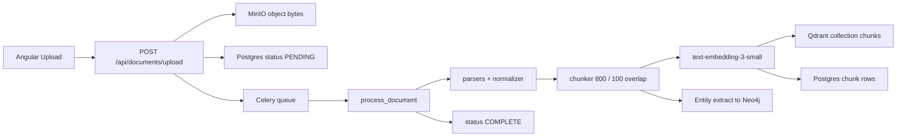

# 01 — Document Ingestion End-to-End (Hands-on)

Trace one file from the browser to searchable vectors (and Neo4j entities).

Memorize this pipeline for interviews:

> Upload → MinIO → Postgres PENDING → Redis/Celery → Parse → Normalize → Chunk (800/100) → Embed (1536-d) → Qdrant + Postgres → Neo4j entities → COMPLETE

---

## Flow diagram



---

## Stage-by-stage (with file links)

### Stage 0 — UI picks a file

| Item | Detail |
|------|--------|
| File | [`frontend/src/app/documents/documents-page/documents-page.component.ts`](../../frontend/src/app/documents/documents-page/documents-page.component.ts) |
| Call | `ApiService.uploadDocument(file)` → `FormData` |
| Service | [`frontend/src/app/shared/services/api.service.ts`](../../frontend/src/app/shared/services/api.service.ts) |

**Hands-on:** Open Network tab → upload fixture → confirm `POST /api/documents/upload` returns `202` with `document_id`.

---

### Stage 1 — Upload API (fast path)

| Item | Detail |
|------|--------|
| File | [`backend/app/api/documents.py`](../../backend/app/api/documents.py) |
| Steps | Validate extension/size → `document_id` → MinIO upload → Postgres insert PENDING → `process_document.delay(...)` |
| Storage | [`backend/app/services/storage_service.py`](../../backend/app/services/storage_service.py) |

**Interview line:** “The API never parses the PDF. It stores the blob and enqueues work so chat stays responsive.”

**Hands-on:**

```bash
# MinIO console: http://localhost:9001 (minioadmin / minioadmin)
# Look for bucket ai-documents / documents/{document_id}/...
```

---

### Stage 2 — Celery worker picks up the job

| Item | Detail |
|------|--------|
| File | [`backend/app/workers/document_worker.py`](../../backend/app/workers/document_worker.py) |
| Task | `process_document` — `max_retries=3`, queue `document_processing` |
| Broker | Redis (`CELERY_BROKER_URL`) |

**Hands-on:** In the worker terminal you should see:

```text
Starting document processing: doc_...
Status updated to PROCESSING
Pipeline: Parsing TXT — sample-rag-fact.txt
Pipeline: Chunking N content blocks
Pipeline: Embedding N chunks
Pipeline: Storing vectors in Qdrant
Pipeline: Neo4j graph update ...
Document processing complete
```

---

### Stage 3 — Parse + normalize

| Item | Detail |
|------|--------|
| Router | [`backend/app/pipeline/normalizer.py`](../../backend/app/pipeline/normalizer.py) → `_route_to_parser` |
| Parsers | [`backend/app/parsers/`](../../backend/app/parsers/) — pdf, docx, pptx, excel, csv, image, audio, video |
| Output | `NormalizedDocument` with `List[ContentBlock]` |

**Interview line:** “Every format becomes the same `ContentBlock` schema so the chunker never cares if the source was PDF or Whisper.”

**Hands-on:** Add a temporary `logger.info` of `len(normalized_doc.content_blocks)` (already logged) and compare a PDF vs the sample TXT.

---

### Stage 4 — Chunking (critical interview topic)

| Item | Detail |
|------|--------|
| File | [`backend/app/pipeline/chunker.py`](../../backend/app/pipeline/chunker.py) |
| Max tokens | **800** (`CHUNK_MAX_TOKENS`) |
| Overlap | **100** (`OVERLAP_TOKENS`) |
| Min tokens | **50** |
| Tokenizer | tiktoken `cl100k_base` |
| Behavior | Heading-aware; flush on heading boundaries without overlap |

**Why these numbers?**

| Choice | Reason |
|--------|--------|
| ~800 tokens | Fits embedding model context; ~1–2 paragraphs of meaning |
| 100 overlap | Sentences on chunk boundaries appear in both chunks |
| Heading-aware | Section title carried as `section_title` metadata for citations |

**Not LangChain** in this project — custom `chunk_document()`. If asked “which LangChain splitter?”, say: “We implemented metadata-aware token chunking ourselves with tiktoken; LangChain’s `RecursiveCharacterTextSplitter` is the common alternative.”

**Hands-on:** In a Python shell (venv active):

```python
from app.pipeline.normalizer import normalize
from app.pipeline.chunker import chunk_document
raw = open("../docs/fixtures/sample-rag-fact.txt","rb").read()
doc = normalize(raw, "doc_test", "sample-rag-fact.txt", "txt")
chunks = chunk_document(doc)
print(len(chunks), chunks[0].chunk_text[:200])
```

---

### Stage 5 — Embeddings

| Item | Detail |
|------|--------|
| File | [`backend/app/pipeline/embedder.py`](../../backend/app/pipeline/embedder.py) |
| Model | `text-embedding-3-small` |
| Dimensions | **1536** |
| Batch | 100 chunks per API call |
| Cache | Redis hash of text → vector |

**What is an embedding?** A list of 1536 floats that places meaning in a high-dimensional space. Similar sentences → vectors with high **cosine similarity**.

**What if you change 1536 → 1600?** Qdrant collection was created with `size=1536`. New vectors fail upsert until you recreate the collection with the new size. Always keep embed model + collection dimension + query embedding model in sync.

**Hands-on:** After ingest, open Qdrant dashboard → collection `chunks` → inspect a point payload (`chunk_text`, `document_id`, `page_number`).

---

### Stage 6 — Store (three stores)

| Store | File | What is stored |
|-------|------|----------------|
| Qdrant | [`backend/app/db/vector_store.py`](../../backend/app/db/vector_store.py) | Vector + payload (text + metadata), Cosine |
| Postgres | [`backend/app/db/postgres.py`](../../backend/app/db/postgres.py) `ChunkModel` | Chunk text, page, section, indexes |
| Neo4j | [`entity_extractor.py`](../../backend/app/pipeline/entity_extractor.py) + [`graph_store.py`](../../backend/app/pipeline/graph_store.py) | Document/Chunk nodes, Entity MENTIONS, RELATED_TO |

**Interview line:** “Postgres for metadata and status, Qdrant for semantic search, Neo4j for relationships — three complementary stores.”

**Hands-on Neo4j Browser** (`http://localhost:7474`):

```cypher
MATCH (d:Document)-[:HAS_CHUNK]->(c:Chunk)
OPTIONAL MATCH (c)-[:MENTIONS]->(e)
RETURN d.file_name, count(DISTINCT c) AS chunks, count(DISTINCT e) AS entities
LIMIT 20
```

---

### Stage 7 — Status COMPLETE

Worker calls `_update_status(..., "complete", chunk_count=N)`.

UI polls `GET /api/documents/{id}` until `status == complete`.

---

## Inspection cheat sheet

```bash
# Document status
curl -s http://localhost:8000/api/documents | jq

# Worker logs
docker-compose logs -f worker
# or watch Celery stdout

# Eval stats
curl -s http://localhost:8000/api/eval/stats | jq
```

---

## Common failures

| Failure | Cause |
|---------|-------|
| Stuck PENDING | No worker / Redis down |
| FAILED after parse | Corrupt file / missing parser deps |
| Zero chunks | Empty OCR / empty transcript |
| Qdrant empty but COMPLETE | Embed returned zeros (no API key) — answers will be weak |
| Neo4j empty | Extraction skipped (no key / Neo4j down) — vector RAG still works |

Next: [02-query-rag-agents-e2e.md](02-query-rag-agents-e2e.md).
