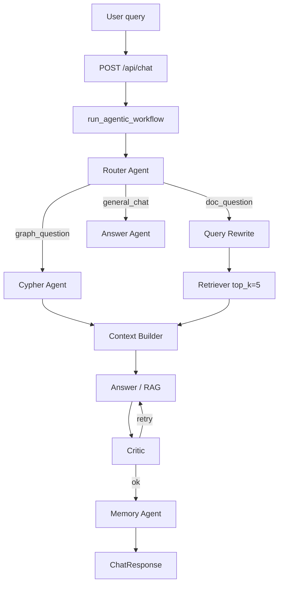

# 02 — Query Path: RAG + Agents End-to-End (Hands-on)

What happens when the user sends one chat message.

Memorize:

> Router → Rewrite → Retriever (Qdrant top_k=5) [+ Cypher if graph] → Context Builder → Answer (GPT-4o) ↔ Critic (max 2 retries) → Memory (Postgres) → answer + citations + debug

---

## Flow diagram



---

## Key parameters (say these numbers in interviews)

| Parameter | Value | Where |
|-----------|-------|-------|
| Chunk max / overlap | 800 / 100 | `pipeline/chunker.py` |
| Embedding model / dims | `text-embedding-3-small` / 1536 | `pipeline/embedder.py` |
| Retrieval top_k | **5** | `db/retriever.py`, `retriever_agent.py` |
| Score threshold | **0.5** (graph enrich 0.4) | `retriever.py` / `graphrag.py` |
| Chat model | `gpt-4o` | `core/config.py` |
| Critic retries | **2** | `agents/workflow.py` |
| Context builder max | 15,000 chars | `context_builder_agent.py` |
| RAG context max | 12,000 chars | `pipeline/rag.py` |

---

## Step-by-step with AgentState

State shape: [`backend/app/models/agent_state.py`](../../backend/app/models/agent_state.py)

Orchestrator: [`backend/app/agents/workflow.py`](../../backend/app/agents/workflow.py) → `run_agentic_workflow`

| # | Agent | File | Reads | Writes |
|---|-------|------|-------|--------|
| 1 | Router | `agents/router_agent.py` | `user_query` | `intent` |
| 2 | Rewrite | `agents/rewrite_agent.py` | query + history | `rewritten_query` |
| 3a | Retriever | `agents/retriever_agent.py` | rewritten query | `retrieved_chunks` |
| 3b | Cypher | `agents/cypher_agent.py` | query | `cypher_query`, `cypher_results` |
| 4 | Context | `agents/context_builder_agent.py` | chunks + graph | `final_context` |
| 5 | Answer | `agents/answer_agent.py` + `pipeline/rag.py` | context/chunks | `draft_answer`, `citations` |
| 6 | Critic | `agents/critic_agent.py` | draft + context | `validated_answer`, `is_grounded` |
| 7 | Memory | `agents/memory_agent.py` | Q&A | Postgres messages + history |

API entry: [`backend/app/api/chat.py`](../../backend/app/api/chat.py) → `_run_agentic_chat` → `ChatResponse`.

---

## Retrieval math (interview sound bite)

1. Embed the **query** with the **same** model used at ingest (`text-embedding-3-small`).
2. Qdrant finds nearest chunk vectors by **cosine similarity**.
3. Top-5 chunk **texts** are injected into the LLM prompt (numbered `[1]…[5]`).
4. GPT-4o answers **only from that context** and cites sources.
5. Critic checks grounding; Memory saves the turn.

The LLM never “queries Qdrant” itself — your backend retrieves text, then the LLM reads text.

Code path:

```text
retriever_agent → retrieve_chunks → embed_query → Qdrant search → RetrievedChunk[]
answer_agent → generate_rag_answer → _build_context → chat_completion
```

---

## GraphRAG path (intent = graph_question)

1. Cypher Agent: LLM generates read-only Cypher → `validate_cypher` blocks DELETE/CREATE/MERGE → run on Neo4j.
2. Retriever uses `graphrag_retrieve` ([`pipeline/graphrag.py`](../../backend/app/pipeline/graphrag.py)):
   - vector top-5
   - entities on those chunks from Neo4j
   - related entities (depth 2)
   - extra chunks for related entities
3. Context Builder merges document context + graph rows.

**Hands-on Cypher safety:**

```python
from app.agents.cypher_agent import validate_cypher
print(validate_cypher("MATCH (n) RETURN n LIMIT 5"))
print(validate_cypher("MATCH (n) DETACH DELETE n"))  # must fail
```

---

## Hands-on lab (after ingesting the fixture)

### Lab 1 — Semantic hit

Ask: `What was Project Aurora Q3 revenue?`

Expect:

- Debug intent: `doc_question`
- Answer mentions **47.3**
- Citations present
- Similarity scores visible in debug panel ([`debug-panel.component.ts`](../../frontend/src/app/debug-panel/debug-panel.component.ts))

### Lab 2 — Paraphrase vs keyword

Ask: `How much money did Aurora make in the third quarter?`

Same fact should retrieve even without exact words — that is embeddings.

### Lab 3 — Miss / low score

Ask: `What is the capital of France?` (with only Aurora doc uploaded)

Expect grounded refusal or weak retrieval; Critic / RAG prompt should avoid inventing Aurora facts.

### Lab 4 — Graph-style question

Ask: `Who is related to Acme Corp in our documents?`

If entities were extracted at ingest, Router may choose `graph_question`; Cypher + GraphRAG enrich context.

### Lab 5 — Streaming

```bash
curl -N -X POST http://localhost:8000/api/chat/stream \
  -H "Content-Type: application/json" \
  -d '{"user_id":"u1","session_id":"s1","message":"Summarize Project Aurora","stream":true}'
```

Frontend: `ApiService.streamMessage` uses `fetch` + ReadableStream SSE events (`token` / `done`).

---

## Response shape

```json
{
  "session_id": "...",
  "answer": "...",
  "citations": [
    {
      "chunk_id": "...",
      "document_id": "...",
      "file_name": "...",
      "page_number": null,
      "section_title": "...",
      "excerpt": "..."
    }
  ],
  "debug": {
    "intent": "doc_question",
    "retrieved_chunks_count": 5,
    "similarity_scores": [0.82, 0.77, ...],
    "cypher_results_count": 0,
    "latency_ms": 2340.5
  }
}
```

---

## Rate limiting & observability

- Rate limit: [`backend/app/core/rate_limiter.py`](../../backend/app/core/rate_limiter.py) — 30 chat req/min/user → HTTP 429
- Langfuse: [`backend/app/services/langfuse_service.py`](../../backend/app/services/langfuse_service.py) — optional traces when keys set
- Eval API: `GET /api/eval/stats`, `POST /api/eval/feedback`

---

## Debugging checklist

| Symptom | Look at |
|---------|---------|
| Always general_chat | Router / OpenAI key |
| Empty citations | Qdrant empty or score < 0.5 |
| Hallucinated answer | Critic skipped (no context) or general_chat path |
| Slow (>10s) | OpenAI latency; critic retries; too many chunks |
| Wrong doc | Pass `document_ids` filter on ChatRequest |

Next: [interview-qa-mapped-to-project.md](../interviews/interview-qa-mapped-to-project.md).
