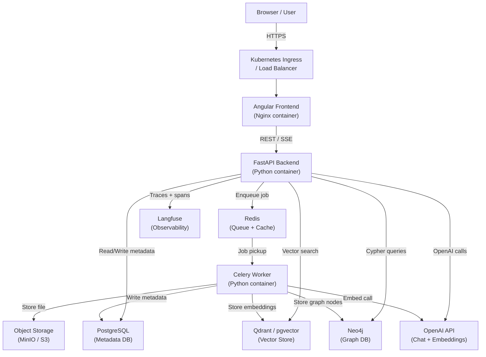
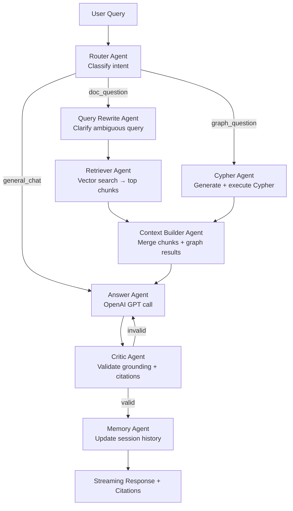
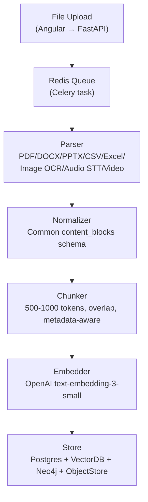

# Milestone 1 — Architecture, Folder Structure, and System Design

## Goal

Understand the complete system before writing a single line of code. By the end of Milestone 1 you will be able to explain every component, every data flow, and every deployment artifact to an interviewer.

---

## 1. End-to-End Architecture



---

## 2. Agentic Workflow (per chat request)



---

## 3. Document Processing Pipeline



---

## 4. Shared Agent State Schema

Every agent reads from and writes to a single Python dataclass / TypedDict:

```python
{
  "user_id": str,
  "session_id": str,
  "user_query": str,
  "intent": str | None,            # set by Router
  "rewritten_query": str | None,   # set by QueryRewrite
  "retrieved_chunks": list,        # set by Retriever
  "cypher_query": str | None,      # set by Cypher
  "cypher_results": list,          # set by Cypher
  "final_context": str | None,     # set by ContextBuilder
  "draft_answer": str | None,      # set by Answer
  "validated_answer": str | None,  # set by Critic
  "citations": list,
  "latency_ms": float | None,
  "token_usage": dict | None,
  "cost": float | None,
  "langfuse_trace_id": str | None
}
```

---

## 5. Neo4j Graph Schema

```
(:Document)-[:HAS_CHUNK]->(:Chunk)
(:Chunk)-[:MENTIONS]->(:Entity)
(:Entity)-[:RELATED_TO]->(:Entity)
(:Chunk)-[:BELONGS_TO_TOPIC]->(:Topic)
(:Decision)-[:SUPPORTED_BY]->(:Chunk)
(:Action)-[:LINKED_TO]->(:Decision)
```

Node labels: `Document`, `Chunk`, `Entity`, `Topic`, `Person`, `Organization`, `Metric`, `Decision`, `Action`

---

## 6. Folder Structure

```
enterprise-ai-assistant/
│
├── frontend/                        # Angular app
│   ├── src/
│   │   ├── app/
│   │   │   ├── chat/                # Chat page + sidebar
│   │   │   ├── documents/           # Upload + library screens
│   │   │   ├── debug-panel/         # Debug overlay component
│   │   │   └── shared/              # Services, models, interceptors
│   │   └── environments/
│   ├── Dockerfile
│   └── nginx.conf
│
├── backend/                         # FastAPI app
│   ├── app/
│   │   ├── api/
│   │   │   ├── chat.py              # /chat endpoints
│   │   │   ├── documents.py         # /documents endpoints
│   │   │   └── health.py
│   │   ├── agents/
│   │   │   ├── router_agent.py
│   │   │   ├── rewrite_agent.py
│   │   │   ├── retriever_agent.py
│   │   │   ├── cypher_agent.py
│   │   │   ├── context_builder_agent.py
│   │   │   ├── answer_agent.py
│   │   │   ├── critic_agent.py
│   │   │   ├── memory_agent.py
│   │   │   └── tool_agent.py
│   │   ├── parsers/
│   │   │   ├── pdf_parser.py
│   │   │   ├── docx_parser.py
│   │   │   ├── pptx_parser.py
│   │   │   ├── excel_parser.py
│   │   │   ├── csv_parser.py
│   │   │   ├── image_parser.py      # OCR
│   │   │   ├── audio_parser.py      # Whisper STT
│   │   │   └── video_parser.py      # ffmpeg + audio
│   │   ├── pipeline/
│   │   │   ├── normalizer.py        # → common content_blocks
│   │   │   ├── chunker.py           # metadata-aware chunking
│   │   │   ├── embedder.py          # OpenAI embeddings
│   │   │   └── ingestion.py         # orchestrates full pipeline
│   │   ├── db/
│   │   │   ├── postgres.py          # SQLAlchemy models + session
│   │   │   ├── vector_store.py      # Qdrant / pgvector client
│   │   │   └── neo4j_client.py      # Neo4j driver + Cypher helpers
│   │   ├── services/
│   │   │   ├── openai_service.py    # chat, embed, summary calls
│   │   │   ├── langfuse_service.py  # trace/span helpers
│   │   │   ├── cache_service.py     # Redis caching
│   │   │   └── storage_service.py   # MinIO / S3 upload
│   │   ├── workers/
│   │   │   └── document_worker.py   # Celery tasks
│   │   ├── models/                  # Pydantic request/response schemas
│   │   │   ├── chat.py
│   │   │   ├── document.py
│   │   │   └── agent_state.py
│   │   ├── core/
│   │   │   ├── config.py            # env-based settings
│   │   │   ├── security.py          # CORS, auth placeholder
│   │   │   └── rate_limiter.py
│   │   └── main.py                  # FastAPI app entry point
│   ├── requirements.txt
│   └── Dockerfile
│
├── worker/
│   └── Dockerfile                   # Same base as backend, runs Celery
│
├── docker-compose.yml               # Full local dev stack
│
└── k8s/                             # Kubernetes manifests
    ├── namespace.yaml
    ├── configmap.yaml
    ├── secret.yaml
    ├── frontend/
    │   ├── deployment.yaml
    │   └── service.yaml
    ├── backend/
    │   ├── deployment.yaml
    │   ├── service.yaml
    │   └── hpa.yaml
    ├── worker/
    │   ├── deployment.yaml
    │   └── hpa.yaml
    ├── redis/
    │   ├── deployment.yaml
    │   └── service.yaml
    ├── postgres/
    │   ├── statefulset.yaml
    │   ├── service.yaml
    │   └── pvc.yaml
    ├── neo4j/
    │   ├── statefulset.yaml
    │   ├── service.yaml
    │   └── pvc.yaml
    └── ingress.yaml
```

---

## 7. Tech Stack — Component Responsibility Map

- **Angular** — UI: chat window, document upload, library, history sidebar, source citation panel, debug panel
- **FastAPI** — REST API, SSE streaming, orchestration, rate limiting, auth
- **OpenAI API** — `gpt-4o` for chat/agents, `text-embedding-3-small` for embeddings, `whisper-1` for audio transcription
- **LangChain / LangGraph** — agent orchestration framework (introduced in Milestone 22)
- **Qdrant** (or pgvector) — vector store for chunk embeddings
- **PostgreSQL** — metadata: documents, chunks, sessions, users
- **Neo4j** — knowledge graph: entities, relationships, topics
- **Redis** — Celery task queue + embedding/retrieval cache
- **Celery** — async document processing worker
- **MinIO** — local S3-compatible object storage for original files
- **Langfuse** — LLM observability: traces, spans, token usage, cost, latency, user feedback
- **Docker** — container images for all services
- **Kubernetes** — production deployment: pods, services, HPA, StatefulSets, Ingress

---

## 8. Kubernetes Concepts (Milestone 1 Primer)

- **Image** — a frozen, portable snapshot of your app and all its dependencies
- **Container** — a running instance of an image, isolated process
- **Pod** — the smallest Kubernetes unit; wraps one or more containers
- **Deployment** — declares how many Pod replicas to run and handles rolling updates (used for stateless: frontend, backend, worker, Redis)
- **StatefulSet** — like Deployment but gives each Pod a stable identity and storage (used for PostgreSQL, Neo4j)
- **Service** — stable DNS name + load balancer in front of a set of Pods
- **Ingress** — HTTP router that maps public hostnames/paths to Services (replaces the Load Balancer at the edge)
- **ConfigMap** — stores non-secret config (URLs, flags) as key-value pairs mounted as env vars
- **Secret** — stores sensitive config (API keys, passwords) base64-encoded, referenced by Pods
- **PersistentVolumeClaim (PVC)** — requests durable disk storage that survives Pod restarts (databases need this)
- **HorizontalPodAutoscaler (HPA)** — automatically increases or decreases Pod replicas based on CPU/memory/custom metrics

---

## 9. Local vs. Production Deployment Strategy

**Local (Docker Compose)**
- Single `docker-compose.yml` starts: frontend, backend, worker, Redis, PostgreSQL, Neo4j, Qdrant, MinIO, Langfuse
- All on one machine, shared Docker network
- Command: `docker compose up --build`

**Production (Kubernetes)**
- Each service runs as isolated Pods in the `ai-assistant` Namespace
- Backend and Worker scale horizontally via HPA
- Databases use StatefulSets with PVCs for durable storage
- Ingress (nginx-ingress-controller) routes `api.*` → backend Service, `app.*` → frontend Service
- Secrets injected via Kubernetes Secret objects (never in source code)
- Command: `kubectl apply -f k8s/`

---

## 10. Milestone Roadmap (30 milestones total)

- **M1** — Architecture + folder structure (this milestone)
- **M2-M3** — Angular + FastAPI skeleton, simple chat UI
- **M4** — OpenAI chat integration
- **M5-M6** — Dockerfiles + Docker Compose
- **M7-M9** — Document upload, PostgreSQL metadata, Redis + Celery
- **M10-M12** — Multi-format parsers, normalizer, chunker
- **M13-M15** — Embeddings, vector store, vector retrieval
- **M16** — RAG answer generation with citations
- **M17-M21** — Neo4j schema, entity extraction, Cypher agent, GraphRAG
- **M22** — Full agentic workflow (all 9 agents)
- **M23** — Langfuse observability
- **M24** — Streaming responses
- **M25** — Caching, rate limiting, concurrency control, retry
- **M26-M28** — Kubernetes manifests, kubectl deploy, scaling tests
- **M29** — Evaluation dashboard + debug panel
- **M30** — README + interview preparation guide

---

## 11. Interview Explanation for Milestone 1

> "I designed the system using a microservices pattern where the frontend, backend API, and document processing worker are completely separate containers. Document ingestion is decoupled from the API using a Redis-backed Celery queue so that uploading a 50-page PDF never blocks the chat API. The knowledge is stored in three complementary stores: PostgreSQL for structured metadata, Qdrant for dense vector similarity search, and Neo4j for entity relationship traversal. Every LLM call is traced in Langfuse so I can observe token usage, latency, and cost in production. On Kubernetes, the stateless backend and worker scale horizontally via HPA while the databases use StatefulSets with PVCs to guarantee durable storage."

---

## 12. Prerequisites to Install Before Milestone 2

- Node.js 20+ and Angular CLI 17+
- Python 3.11+
- Docker Desktop (or Docker Engine + Compose plugin)
- A code editor (VS Code / Cursor)
- OpenAI API key (set in `.env`, never committed)
- Langfuse account (free tier) or self-hosted Langfuse
