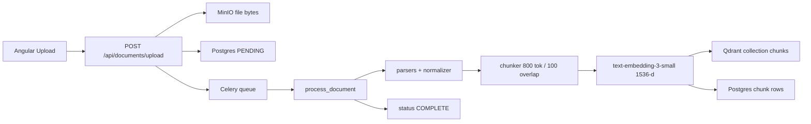
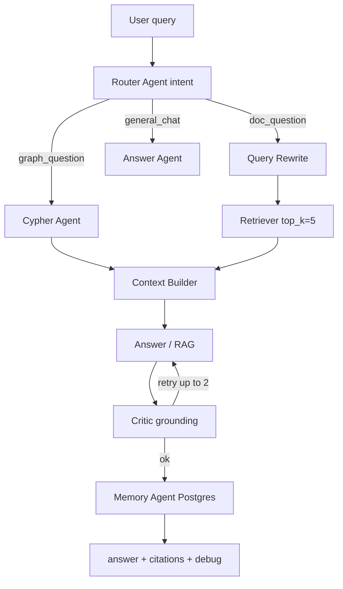

# Hands-on E2E Testing + Interview Deep Dive

You will use **this project as your interview story**. Every answer below maps to real files under [`enterprise-ai-assistant/`](enterprise-ai-assistant/). Goal: run the stack, watch each stage, then rehearse Q13–Q70 (RAG/agents/memory) with code open.

---

## Part A — How to test that the codebase works

### Prerequisites
- Docker + Compose, Python 3.11+, Node 20+
- Real `OPENAI_API_KEY` in `.env` (placeholder keys are rejected)

### Path 1 (recommended): Full Docker
```bash
cd enterprise-ai-assistant
cp .env.example .env   # set OPENAI_API_KEY; align Postgres/Neo4j passwords with compose (dev_password)
docker compose up --build
```
| URL | Service |
|-----|---------|
| http://localhost:4200 | Angular UI |
| http://localhost:8000/docs | FastAPI Swagger |
| http://localhost:6333/dashboard | Qdrant |
| http://localhost:7474 | Neo4j Browser |
| http://localhost:9001 | MinIO console |

### Path 2: Infra Docker + hot-reload apps
```bash
docker compose -f docker-compose.dev.yml up
# then uvicorn + celery worker + ng serve (see README)
```

### Verification checklist (do in order)
1. **Health**
   - `curl localhost:8000/health`
   - `curl localhost:8000/health/ready`
   - `curl localhost:8000/api/eval/health` (Postgres, Redis, Qdrant, Neo4j, MinIO)
2. **Smoke script**: `python scripts/test-pipeline.py` then `python scripts/test-pipeline.py --file ./sample.pdf`
3. **UI**: Upload a PDF on Documents → wait until status `complete` → ask a question on Chat that only the PDF can answer → check citations + debug panel
4. **Worker logs**: `docker compose logs -f worker` — confirm parse → chunk → embed → Qdrant
5. **Optional load**: `python scripts/load-test.py --url http://localhost:8000 --users 5 --duration 30`

### What must be up for which feature
| Feature | Required |
|---------|----------|
| Simple chat | Backend + OpenAI |
| RAG over uploads | + Redis, Celery worker, MinIO, Qdrant, Postgres |
| GraphRAG / Cypher | + Neo4j + entities in graph (see gap below) |

### Known gap (important for honesty in interviews)
Entity extraction → Neo4j (`entity_extractor.py`, `graph_store.py`) exists but is **not called** from [`document_worker.py`](enterprise-ai-assistant/backend/app/workers/document_worker.py) yet. GraphRAG at query time needs Neo4j data; wire extract/store into the worker as a follow-up hands-on task.

---

## Part B — End-to-end mechanisms (memorize these)

### B1. Document ingestion (upload → searchable)



| Stage | File | What to say in interview |
|-------|------|--------------------------|
| Upload API | [`api/documents.py`](enterprise-ai-assistant/backend/app/api/documents.py) | Validate, MinIO, Postgres, enqueue — API returns in ~100ms |
| Async | [`workers/document_worker.py`](enterprise-ai-assistant/backend/app/workers/document_worker.py) | Celery + Redis so large PDFs never block chat |
| Parse | [`parsers/*`](enterprise-ai-assistant/backend/app/parsers/) + [`normalizer.py`](enterprise-ai-assistant/backend/app/pipeline/normalizer.py) | Format-specific → common `ContentBlock` schema |
| Chunk | [`chunker.py`](enterprise-ai-assistant/backend/app/pipeline/chunker.py) | **800 max / 100 overlap / 50 min**, tiktoken `cl100k_base`, heading-aware |
| Embed | [`embedder.py`](enterprise-ai-assistant/backend/app/pipeline/embedder.py) | OpenAI `text-embedding-3-small`, **1536 dims**, batch 100, Redis cache |
| Vector store | [`vector_store.py`](enterprise-ai-assistant/backend/app/db/vector_store.py) | Qdrant, Cosine, collection `chunks` |

### B2. User query (chat → answer)



| Agent | File | Role |
|-------|------|------|
| Router | [`router_agent.py`](enterprise-ai-assistant/backend/app/agents/router_agent.py) | Classify intent |
| Rewrite | [`rewrite_agent.py`](enterprise-ai-assistant/backend/app/agents/rewrite_agent.py) | Disambiguate + resolve pronouns |
| Retriever | [`retriever_agent.py`](enterprise-ai-assistant/backend/app/agents/retriever_agent.py) + [`retriever.py`](enterprise-ai-assistant/backend/app/db/retriever.py) | Embed query → Qdrant cosine top_k=5, threshold 0.5 |
| Cypher | [`cypher_agent.py`](enterprise-ai-assistant/backend/app/agents/cypher_agent.py) | Text→Cypher with DELETE/CREATE blocked |
| Context | [`context_builder_agent.py`](enterprise-ai-assistant/backend/app/agents/context_builder_agent.py) | Merge chunks + graph results |
| Answer | [`answer_agent.py`](enterprise-ai-assistant/backend/app/agents/answer_agent.py) + [`rag.py`](enterprise-ai-assistant/backend/app/pipeline/rag.py) | Grounded GPT-4o + citations |
| Critic | [`critic_agent.py`](enterprise-ai-assistant/backend/app/agents/critic_agent.py) | Faithfulness check |
| Memory | [`memory_agent.py`](enterprise-ai-assistant/backend/app/agents/memory_agent.py) | Short-term history in state; long-term in Postgres |
| Orchestrator | [`workflow.py`](enterprise-ai-assistant/backend/app/agents/workflow.py) | Shared `AgentState` TypedDict |

**Retrieval math (say this):** same embedding model for docs and queries → vectors in same space → cosine similarity → top-k chunks injected into prompt → LLM answers only from that context → Critic validates grounding.

---

## Part C — Interview questions mapped to THIS project

Grouped for study. For each cluster: **one-liner**, **project answer**, **hands-on**.

### C1. Intro / experience (Q1–Q8, Q71–Q72)
- Frame this repo as your flagship GenAI project: RAG + GraphRAG + 8-agent workflow + Docker/K8s.
- Problem: enterprise users need answers from private docs with citations, not generic LLM knowledge.
- Your role: architecture + backend pipeline + agents + retrieval + deployment.

### C2. Data security / guardrails (Q9–Q12)
Map to what exists + what to claim as design:
- Data stays in your infra (MinIO/Postgres/Qdrant/Neo4j); only chunks needed for the query go to OpenAI.
- Secrets via `.env` / K8s Secrets, never in code.
- Rate limiting ([`rate_limiter.py`](enterprise-ai-assistant/backend/app/core/rate_limiter.py)), Cypher allowlist (no write keywords), Critic as content grounding guardrail.
- **Hands-on:** show Secret vs ConfigMap; show `validate_cypher` rejecting `DELETE`; explain PII redaction as a recommended pre-LLM step (not fully implemented—say so honestly).

### C3. RAG core (Q13–Q30) — highest priority
| Q | Answer from this project |
|---|--------------------------|
| Why RAG? | Fresh, private, citable knowledge without fine-tuning |
| Alternatives? | Fine-tune, long-context dump, pure SQL — tradeoffs |
| Disadvantages | Retrieval misses, chunk boundary loss, latency/cost, chunking quality |
| Frameworks | FastAPI, OpenAI SDK, Celery, Qdrant, Neo4j, custom agents (LangGraph-ready) |
| Chunk params | 800 / 100 overlap / heading-aware / tiktoken — **not** LangChain `RecursiveCharacterTextSplitter` (custom in `chunker.py`) |
| Embeddings | `text-embedding-3-small`, 1536 dims = vector length; changing to 1600 **breaks** Qdrant collection (size mismatch) unless you recreate collection |
| Mechanism | Semantic proximity in high-dim space; similar meaning ≈ high cosine |

**Hands-on lab:**
1. Upload a short PDF with a unique fact.
2. Ask that fact in Chat; read `debug.retrieved_chunks_count` and similarity scores.
3. Open Qdrant dashboard → inspect point payload.
4. Change a word in the question; observe scores.
5. Read `chunker.py` and `embedder.py` line-by-line once.

### C4. Vector + graph (Q31–Q38, Q69–Q70)
- Neo4j = **graph** DB; Qdrant = **vector** DB.
- Combine: vector retrieve chunks → Neo4j entity neighbors → enrich context ([`graphrag.py`](enterprise-ai-assistant/backend/app/pipeline/graphrag.py)).
- Other vectors: Pinecone, Weaviate, Chroma, pgvector; other graphs: Amazon Neptune, ArangoDB, TigerGraph.
- LLM uses vectors **indirectly**: retrieve text → put text in prompt → LLM generates (LLM never “queries” Qdrant itself).

### C5. Multi-source RAG + agents (Q39–Q51)
Design answer using **Router + source-specific tools**:
- Website → crawl/scrape → same parse→chunk→embed
- Folder → batch MinIO upload → Celery
- Postgres → SQL tool agent (not only embeddings)
- Excel → `excel_parser.py` path
- Routing = this project's Router Agent; communication = shared `AgentState`; sequential with optional parallel Cypher+Retriever; reduce latency via cache, smaller models for router, parallel I/O, streaming SSE.

### C6. MCP / memory / stateful (Q52–Q68)
- **MCP**: Model Context Protocol — standard way for hosts to expose tools/resources to agents (like USB for AI tools). Not implemented in this repo; explain conceptually + map to our tool-style agents.
- **Short-term memory**: last N turns in `conversation_history` / session.
- **Long-term**: Postgres messages (+ optional vector memory of past facts).
- LLM is **stateless**; agentic app is **stateful** via `AgentState` + DB.
- Mixing GPT-3.5/4 + Ada/Gemini: configure chat model and embedding model **independently** in settings (`openai_chat_model` vs `openai_embedding_model`); memory attaches to session, not to a specific model pair—but embeddings must stay consistent with the vector index.

### C7. Tools, Python, ML side questions (Q73–Q80)
- Decorators: `@celery_app.task`, FastAPI route decorators.
- Tools/toolkits: functions agents can call (retriever, Cypher, upload); Cypher Agent ≈ tool with validation.
- Q79–Q80 tic-tac-toe/Q-learning: separate from this project—answer from that experience; do not force-fit this repo.

---

## Part D — Suggested study schedule (hands-on)

| Day | Focus | Actions |
|-----|-------|---------|
| 1 | Bring-up + smoke | Docker up, health, upload PDF, first RAG answer |
| 2 | Ingestion deep dive | Trace worker logs; inspect MinIO, Postgres chunks, Qdrant points |
| 3 | Query path deep dive | Set breakpoints / logs in Router→Retriever→RAG→Critic; explain with debug panel |
| 4 | Interview drill C3–C4 | Answer Q13–Q38 out loud with files open |
| 5 | Agents + multi-source | Answer Q39–Q70; sketch 4-source architecture on whiteboard |
| 6 | Gap fix (optional) | Wire entity extract → Neo4j in worker; re-test GraphRAG |

### Deliverable docs to produce (when you exit Plan mode and approve implementation)
1. **`docs/hands-on/00-test-the-system.md`** — run/test checklist with exact curls
2. **`docs/hands-on/01-document-ingestion-e2e.md`** — stage-by-stage with file links
3. **`docs/hands-on/02-query-rag-agents-e2e.md`** — query path with AgentState fields
4. **`docs/interviews/interview-qa-mapped-to-project.md`** — Q1–Q81 with project-specific answers + “say this in interview”
5. Optional: wire Neo4j entity extraction into Celery worker so GraphRAG is demoable

---

## Part E — 60-second system pitch (memorize)

> "Users upload enterprise documents; Celery workers parse, chunk at 800 tokens with 100 overlap, embed with text-embedding-3-small into Qdrant, and store metadata in Postgres. On chat, a Router classifies intent; for document questions we rewrite the query, retrieve top-5 cosine-similar chunks, build grounded context, generate with GPT-4o, and a Critic checks faithfulness before Memory persists the turn. Graph questions also run Cypher against Neo4j for relationship traversal. Everything is Dockerized and K8s-ready with HPA on API and workers."
